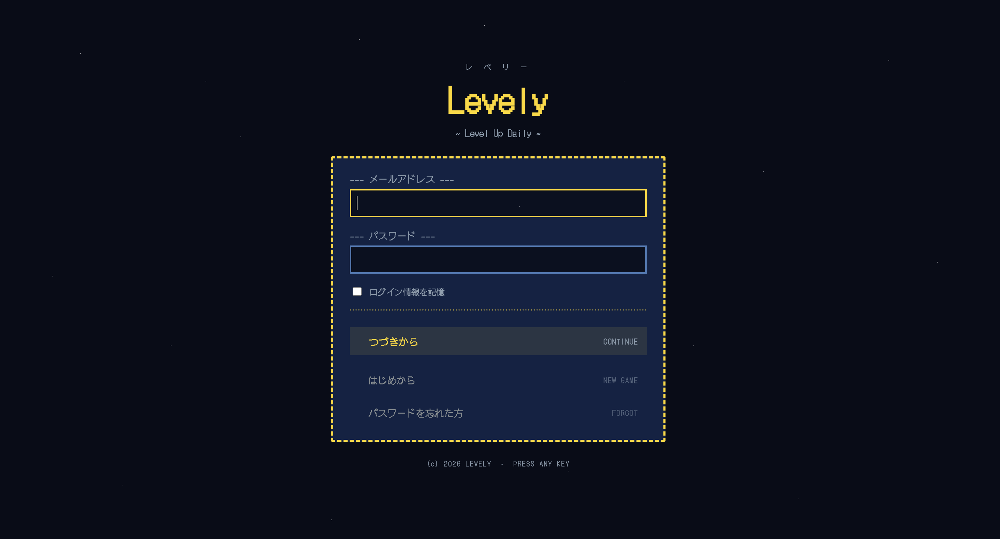
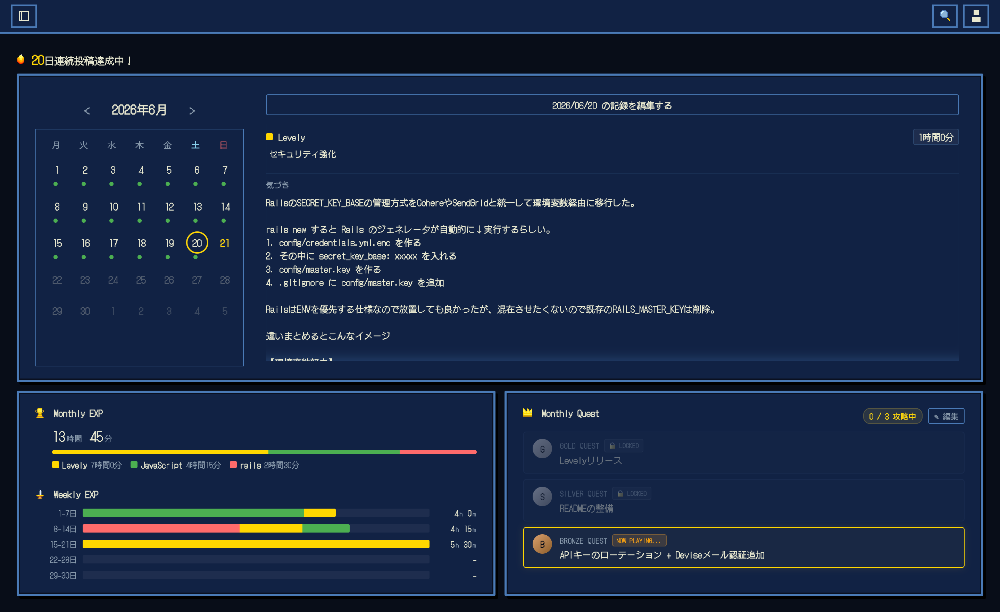
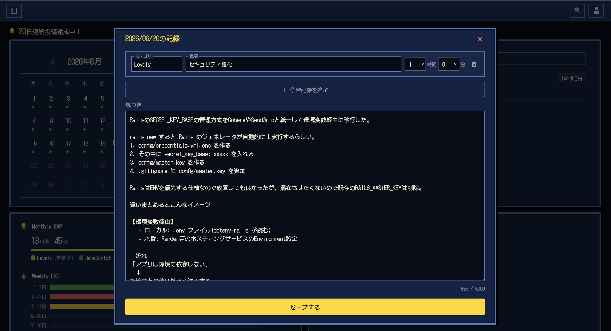
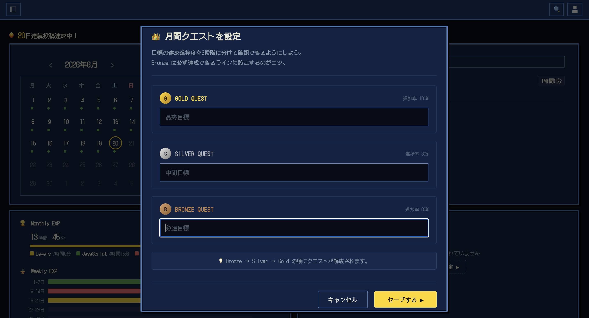
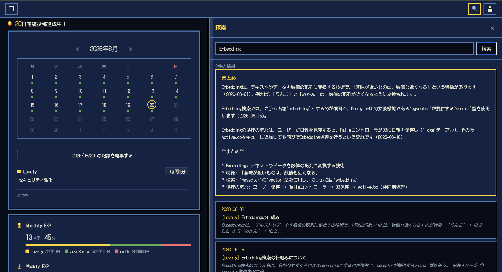
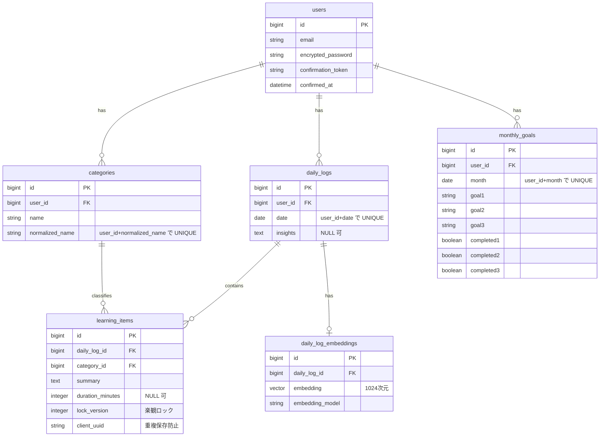
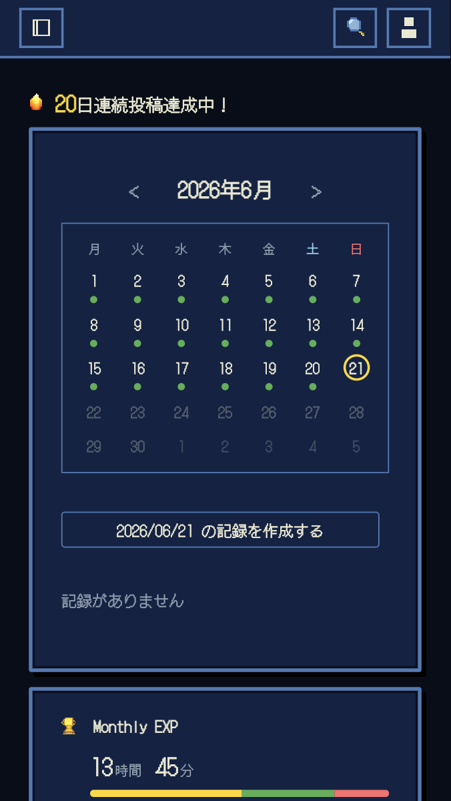
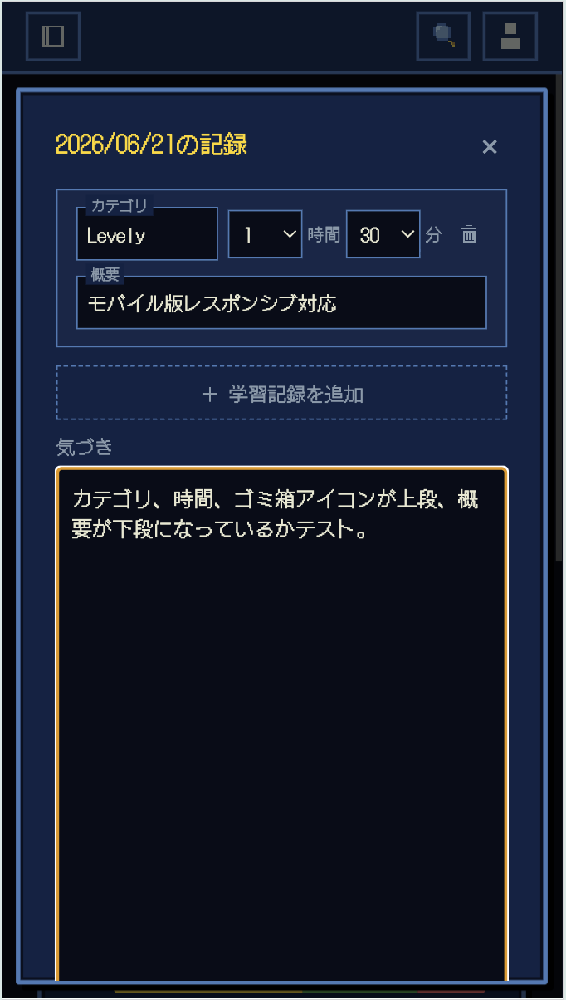

<div align="center">

# Levely

_~ Level Up Daily ~_

**学んだことを「あとから使える形」で残す、エンジニア向け学習記録アプリ**



</div>

---

## 概要

| 項目       | 内容                                        |
| ---------- | ------------------------------------------- |
| 開発期間   | 2026年3月〜（継続中）                       |
| 開発体制   | 個人開発（企画・設計・実装・運用すべて1人） |
| デプロイ先 | Render                                      |

ログイン後はカレンダー型のメイン画面が開き、学習記録の入力・月間集計・月間目標・AI 検索など主要機能の入り口がここに集約されている。

<p align="center">
  
</p>

## なぜ作ったか

エンジニアとして学習を進める中で、「理解している状態」とは何かを考えるようになった。
それは単に知識を覚えていることではなく、**自分の中で構造として整理されていて、他者に伝えられる状態** だと感じている。

しかし実際には、「理解しているつもり」だったのに、いざ説明や質問をしようとすると、
何をどう伝えればいいのか分からない、ということが何度もあった。
分からないことが多いほど、「何が分からないのか」自体が曖昧になっていた。

この経験から、**「分からない」をそのままにせず、言葉にして整理することで初めて「分かる」に近づける** と気づいた。
AI 時代においては、前提や意図を含めて正確に伝える力がこれまで以上に重要になる。
曖昧な理解のままでは適切な質問もできず、ツールを使いこなすこともできない。

だからこそ、日々の学習をただ記録するだけで終わらせず、
**後から見返して理解を深めたり、自分の言葉で整理し直せる形で残す** ことを目指して、本サービスを開発した。

## 主な機能

### カレンダー型の日報・学習記録入力

カレンダーで選んだ日の編集ボタンからモーダルを開き、カテゴリ・学習時間・概要を構造化して入力。
「気づき」欄でその日全体の振り返り単体でも残せる。
複数行を一括で **明示的に保存** する設計。

<p align="center">
  
</p>

### 月間目標

月ごとに Gold / Silver / Bronze の **3段階の目標** を設定し、達成状況をトラッキング。
RPG 風 UI でゲーミフィケーションし、達成可能な Bronze から段階的に解放される設計。

<p align="center">
  
</p>

### AI による意味検索

検索バーに自由に文字を入力すると、過去の学習記録の中から意味的に近いものを取得。
完全一致のキーワードを覚えていなくても、おおまかな内容で過去の学びを探せる。

<p align="center">
  
</p>

### メール認証付きユーザー登録

Devise の `:confirmable` を使った本人確認付きサインアップ。
パスワード変更・メールアドレス変更時の通知メールにも対応。

## 使用技術

| 領域                 | 使用技術                                                                                                                          |
| -------------------- | --------------------------------------------------------------------------------------------------------------------------------- |
| 言語・フレームワーク | Ruby 3.3.0 / Rails 7.2                                                                                                            |
| フロントエンド       | Hotwire (Turbo, Stimulus) / Importmap                                                                                             |
| データベース         | PostgreSQL + [pgvector](https://github.com/pgvector/pgvector)                                                                     |
| 認証                 | Devise（`:confirmable` 有効）                                                                                                     |
| AI / 埋め込み・要約  | Cohere API（埋め込み: `embed-multilingual-v3.0` / 要約: `command-a-03-2025`）/ [neighbor](https://github.com/ankane/neighbor) gem |
| メール送信           | SendGrid（本番）/ letter_opener（開発）                                                                                           |
| デプロイ             | Render                                                                                                                            |
| テスト・品質         | RSpec / RuboCop / Brakeman                                                                                                        |
| その他               | PWA 対応（manifest / service worker）                                                                                             |

## アーキテクチャ

### データモデル



主要なテーブル：

- `users` — 認証・ユーザー情報（Devise `:confirmable`）
- `daily_logs` — 日報。`[user_id, date]` で一意
- `learning_items` — 学習記録。`daily_logs` と `categories` に紐づく
- `categories` — ユーザー固有のカテゴリ（正規化された name で一意）
- `daily_log_embeddings` — 1日報 = 1ベクトル（pgvector）
- `monthly_goals` — 月間目標（3件セット/月）

## 工夫した点・技術的チャレンジ

### DB 制約とモデルバリデーションの二段防御

モデルの `presence: true` だけでなく、DB 側にも `null: false` と UNIQUE 制約を徹底。
Strong Parameters や `update_column` のすり抜けが起きても、最終的に DB が弾く設計。

### AI による意味検索の実装

Cohere の Embed API で文章を 1024 次元のベクトルに変換し、pgvector で類似度検索（Cosine、しきい値 0.5）を実施。
さらに Cohere の生成モデル（`command-a-03-2025`）で検索結果を要約して、ドロワー内に表示。

### 楽観ロック + 冪等性キーによる保存の整合性

学習記録の保存に `lock_version`（楽観ロック）と `client_uuid`（冪等性キー）を導入。
複数行を一括保存する際の衝突や、ネットワーク再送による二重作成を防ぐ。

### カテゴリの正規化

ユーザーが入力したカテゴリ名を `normalized_name`（前後空白除去・連続空白縮約・小文字化）で正規化。
表記ゆれを統合し、`[user_id, normalized_name]` の UNIQUE 制約で同じカテゴリの重複作成を防ぐ。

### SPA 風モーダル UI

画面遷移を避け、Stimulus でカレンダーの日付クリック → モーダル展開 → 即保存のフローを実現。
ページリロードなしで月単位の学習を一望できる。

### PWA 対応・モバイル UI

manifest / service worker を設定し、スマホのホーム画面から起動可能に。
学習を「思いついた瞬間」に開いて記録できる UX を意識。
モバイルでは入力モーダルをカード形式へレイアウト変更するなど、スマホ向けに細部を調整。

<table align="center">
  <tr>
    <td align="center"></td>
    <td align="center"></td>
  </tr>
  <tr>
    <td align="center"><sub>メイン画面</sub></td>
    <td align="center"><sub>日報入力モーダル</sub></td>
  </tr>
</table>

### メール認証フロー

Devise `:confirmable` を導入し、登録〜認証〜パスワード変更通知までを日本語化。
SendGrid の SMTP を本番で利用、開発時は letter_opener で内容確認。

## 設計の進化

実装を進めながら、当初の設計から判断を変えた箇所を記録する。
「使ってみて気づいた違和感」を起点に、UX と実装方針を見直した。

### 一画面完結化

当初は週ごとの学習時間集計を別の分析ページで管理する予定だった。
しかし実装中に **「別ページに入る = 結局見ない」** と気づき、必ず目につく月間ビューに **さりげなく組み込む** 形に変更。
日報の編集も同様に **選んだ日の編集ボタンからモーダルを開く形** に統合し、記録の閲覧・編集・追加・削除から、学習時間の集計・月間目標までを **1画面で完結** させた。

### 自動保存から明示保存への転換

当初は debounce による自動保存を実装していたが、AI 検索が保存連動だったため、
**自動保存が走るたびに AI 検索が発火してしまう** タイミング問題があった。
両者を切り離す判断をし、保存は **明示的なセーブボタン** に変更してタイミングを明確化。

### AI 検索の再設計

発想は試行錯誤で変わっていった。

- **当初**：日報を保存すると、関連する過去投稿を自動表示。→ 保存タイミングと連動する難しさがあった
- **次に**：「関連を探す」ボタンを置き、ユーザーが任意で発火。→「日報を書いた後にわざわざ過去投稿との関連を見るか？」と疑問に感じた
- **現在**：完全に独立したドロワーで、**キーワード（完全一致でなくても OK）で検索 + AI による要約** を返す形に

「保存後に過去を振り返る」から「必要な時に過去を探す」へ発想を変えたことで、日報に依存しない再利用しやすい機能になった。

### 月間目標のゲーミフィケーション

当初は月間目標を1つだけ設定する想定だった。
しかし、それだと達成困難な目標を立てがちで **達成できなかったらそれが当たり前になり、自己イメージが下がる** と感じ、
**Gold（最終目標）/ Silver（中間目標）/ Bronze（必達目標）** の3段階に分割。
最終目標から逆算して設計し、達成可能な Bronze から順次解放される仕組みにすることで、
仮にGold まで届かなくても **「ここまでは達成できた」と勝ち癖をつけながら** 楽しく続けられる設計とした。

### 一貫したゲーム風 UI

ピクセル風フォント、▶️ などのゲーム的アイコン、「セーブする」「クエスト」「NOW PLAYING」「LOCKED」など、
**全体で RPG 風の用語と表現を統一**。
学習という続けにくい行為を「楽しい体験」として包み込むため、細部まで世界観を揃えた。

## 今後の改善予定

### 新機能

- [ ] サービス紹介用ランディングページの作成
- [ ] 学習計画と振り返りを繋ぐスケジュール管理機能の追加

### UX 改善

- [ ] ユーザーメニュー（ヘッダーアイコン）配下の設定画面を刷新
- [ ] 全体的な UI のブラッシュアップ

### 既知の不具合修正

- [ ] カテゴリ名の変更が即座に画面へ反映されない問題の修正

## セットアップ

### 前提

- Ruby 3.3.0（`.ruby-version` に準拠）
- Rails 7.2.x
- PostgreSQL（開発・本番ともに想定）

### 手順

1. **依存関係のインストール**

   ```bash
   bundle install
   ```

2. **環境変数の設定**

   `.env` は **Git にコミットしません**（`.gitignore` で除外済み）。

   ```bash
   cp .env.example .env
   ```

   `.env` を編集し、PostgreSQL の接続情報や Cohere API キー等を設定してください。

   **PostgreSQL を Docker（OrbStack 等）で動かす場合：**

   ```bash
   docker compose up -d
   ```

   `config/database.yml` の `LEVELY_DATABASE_*` と `docker-compose.yml` は同じ変数名で揃えています。

3. **データベースの準備**

   ```bash
   bin/rails db:prepare
   ```

   存在しないデータベースの作成・マイグレーション適用までを行います。

4. **サーバーの起動**

   ```bash
   bin/rails server
   ```

   ブラウザで `http://localhost:3000` を開いてください。

### テスト

```bash
bin/rspec
```

### 本番（Render）

PostgreSQL を Web サービスにリンクすると `DATABASE_URL` が自動で設定されます。
SendGrid / Cohere の API キーも Render の Environment から設定してください。

## セキュリティ

- `.env` や `config/master.key` はリポジトリ管理外
- `.env.example` にはダミー値のみ
- 機密ファイル（`.env`, `credentials.yml.enc` 等）は AI ツールからも除外設定済み
- 誤って秘密情報をコミットした場合は、履歴の改変だけでなく **該当の資格情報をローテーション** することを推奨
